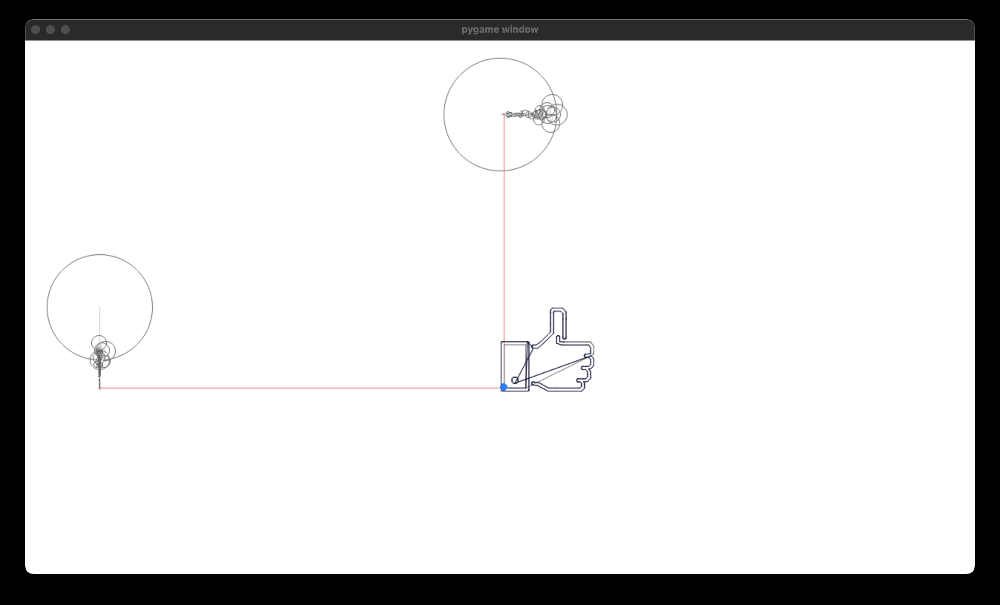

# Fourier Transform Drawing
## Phys 2260 Final Project
By Ethan Lior and Andrew Antenberg
## Overview
In this project, we use fourier series to approximate the x and y values of a given path. We can generate such paths from SVG files, allowing us to approximate very complex shapes with these two waves.
## How to use
To get started, simply run all the cells in fourier.ipynb! You will be prompted to choose one of the existing fourier visualization features: text rendering, maze solving, and svg rendering.
### Text Rendering
Simply type any word (using capital letters, lowercase letters, or spaces), and watch as the fourier series outlines the text!

### Maze Solving
Choose a maze dimension and maze solving algorithm, and see the fourier series outline that algorithm's chosen path from the top left corner of the newly generated maze to the bottom right. Available maze solvers are brownian motion random walk and BFS (optimal).

### SVG
Type the path to any svg file and see the fourier series outline the paths in the svg!

## Usage Notes
- To re-run the program, just stop the execution of the last cell, and run that cell again! Closing the pygame window may cause issues due to limitations with Jupyter Notebook, so leave the window open until you are completely done!
- In the visualization window, tap the space bar to see wave information, like the number of waves created, the min/max amplitude, and the min/max freuency.